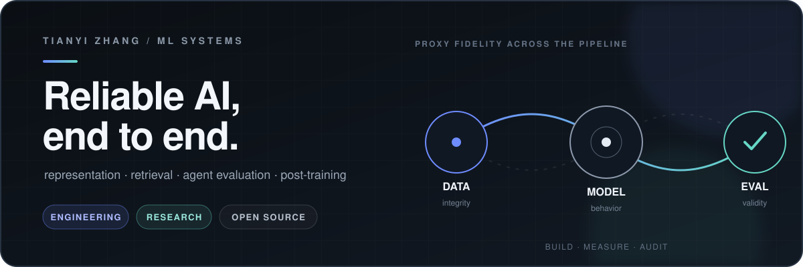

  

  Machine learning engineer and researcher building reliable AI systems across product, infrastructure, and evaluation.

  <strong>LinkedIn Feed AI</strong> · ML Engineer Intern &nbsp;&nbsp;|&nbsp;&nbsp;
  <strong>Georgia Tech</strong> · M.S. Computer Science

<table>
  <tr>
    <td width="33%" align="center"><strong>Systems</strong> Representation · Retrieval · Distributed ML</td>
    <td width="33%" align="center"><strong>Research</strong> Agent Evaluation · Benchmark Integrity</td>
    <td width="33%" align="center"><strong>Open Source</strong> LLM Post-training · NVIDIA NeMo RL</td>
  </tr>
</table>

  <a href="https://tianyi-zhang-02.github.io">Website</a> ·
  <a href="https://www.linkedin.com/in/tianyi-zhang2002/">LinkedIn</a> ·
  <a href="https://scholar.google.com/citations?user=46rbYk0AAAAJ">Google Scholar</a> ·
  <a href="mailto:zhangtianyi975@gmail.com">Email</a>

