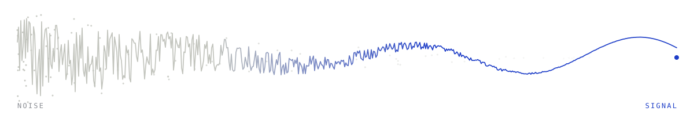

  <picture>
    <source media="(prefers-color-scheme: dark)" srcset="assets/banner-dark.svg">
    
  </picture>

<h1 align="center">Tianyi Zhang</h1>

  <b>I like turning noise into signal.</b> 
  Measurement and observability for systems that run without anyone watching every step.

  Shanghai · Atlanta · Bay Area

  <a href="https://tianyi-zhang-02.github.io">Website</a> ·
  <a href="https://tianyi-zhang-02.github.io/cooking-agi/">AGI 大锅烩</a> ·
  <a href="https://scholar.google.com/citations?user=46rbYk0AAAAJ">Scholar</a> ·
  <a href="https://www.linkedin.com/in/tianyi-zhang2002/">LinkedIn</a> ·
  <a href="mailto:zhangtianyi975@gmail.com">Email</a>

---

## What I like

**Noise → signal.** Most of what looks like a result isn't one — a benchmark that
measures something other than what it claims, a correlation standing in for a cause,
a metric quietly drifting from the thing it was supposed to stand for. The part I
enjoy is finding the one measurement that tells those apart.

## What I'm into

LLMs, and most of what sits downstream of them — **conversational** systems,
**search** and retrieval, and making both genuinely **personalized**. Two directions
I keep coming back to:

- ⚡ **Faster** — inference acceleration. Latency isn't a detail, it's the product.
- 🧠 **Smarter** — reasoning and memory. Thinking longer, and remembering what happened.

## How I like to work

**Start from the problem.** Find one worth solving, then go get the method — not a
method wandering around looking for somewhere to land.

**Sufficient is better.** Not *more is better*, not *less is better* — ***enough*** is
better. The right amount of context, of retrieval, of thinking, of alerting. A monitor
that fires constantly is as useless as one that never fires; a model that reasons for a
page on a one-line question hasn't gotten smarter. Most of the interesting work is
finding where that line sits. 讲究一个度 :)

## What I'm building

- **[NVIDIA NeMo-RL](https://github.com/NVIDIA-NeMo/RL)** — upstream contributions to the LLM post-training stack: dataset and checkpoint correctness, plus a tensor-parallel rewrite of top-k distillation that drops the dominant intermediate from `O(TV)` to `O(TK)`. &nbsp;[Merged commits →](https://github.com/NVIDIA-NeMo/RL/commits/main/?author=tianyi-zhang-02) Yes, there is RLHF in here. No, not that one — ***R**eally **L**onging for **H**otpots and **F**ries* 🍲🍟
- **[cooking-agi](https://github.com/tianyi-zhang-02/cooking-agi)** — 「AGI 大锅烩」, bilingual notes on models, data, memory, search, feedback, and evaluation. Learning by having to write it down clearly. &nbsp;[Read →](https://tianyi-zhang-02.github.io/cooking-agi/)

## Off the clock

Big landscapes and a camera — and, one of these days, a dog.

🐕‍🦺 我是真的想养德牧 😭 &nbsp;(I really, *really* want a German Shepherd.)

Banner generated by <a href="assets/make_banner.py"><code>assets/make_banner.py</code></a> — no hand-drawn figures.
