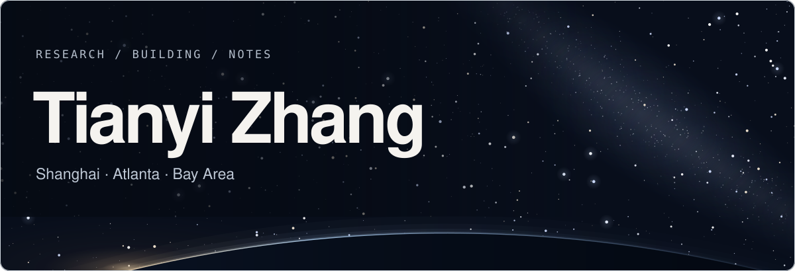

<picture>
  <source media="(max-width: 600px) and (prefers-reduced-motion: reduce)" srcset="assets/banner-static-mobile.svg">
  <source media="(prefers-reduced-motion: reduce)" srcset="assets/banner-static.svg">
  <source media="(max-width: 600px) and (prefers-color-scheme: dark)" srcset="assets/banner-dark-mobile.svg">
  <source media="(max-width: 600px)" srcset="assets/banner-light-mobile.svg">
  <source media="(prefers-color-scheme: dark)" srcset="assets/banner-dark.svg">
  
</picture>

  <a href="https://tianyi-zhang-02.github.io/">Website ↗</a> &nbsp;·&nbsp;
  <a href="https://scholar.google.com/citations?user=46rbYk0AAAAJ">Google Scholar ↗</a> &nbsp;·&nbsp;
  <a href="https://www.linkedin.com/in/tianyi-zhang2002/">LinkedIn ↗</a>

I'm a Computer Science master's student at **Georgia Tech**, graduating in May 2027.

My interests are **representation learning, LLM post-training, and model / agent evaluation**. I'm especially interested in learning from sparse, noisy feedback—and figuring out whether a model really improves.

### Building & learning

**[AGI Study Notes · AGI 大锅烩 ↗](https://github.com/tianyi-zhang-02/cooking-agi)** 
Bilingual notes on ML and language models, with interactive diagrams. Learning in public, together with friends. 
[English](https://tianyi-zhang-02.github.io/cooking-agi/index.en.html) · [中文](https://tianyi-zhang-02.github.io/cooking-agi/)

### Off the clock

Road trips, national parks, and [music for the way ↗](https://open.spotify.com/playlist/5mvXtbOcZx8t4gBWIZTFZn).
